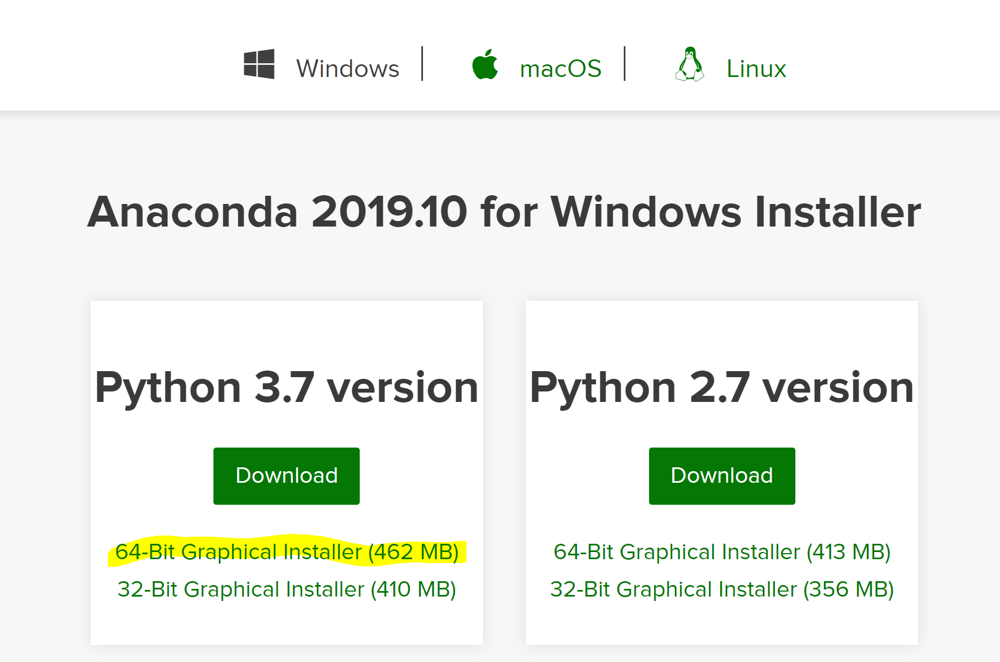
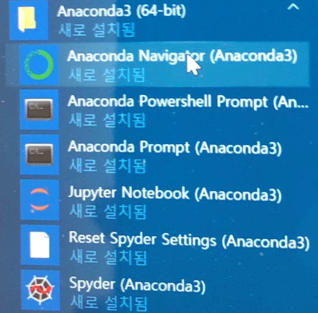
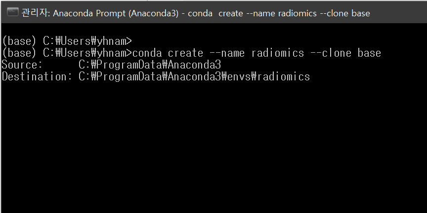
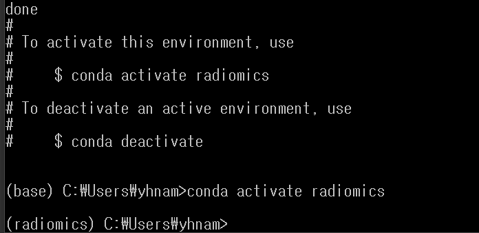
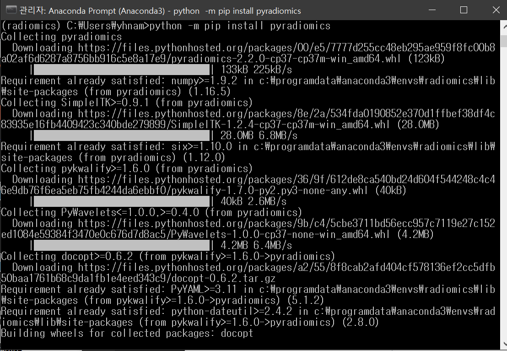
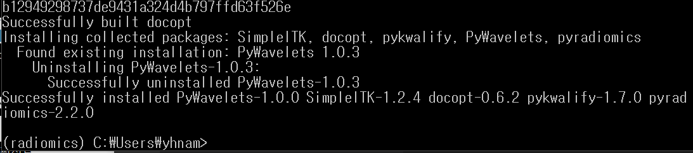
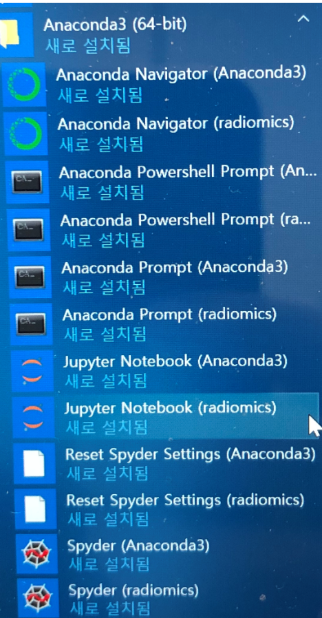
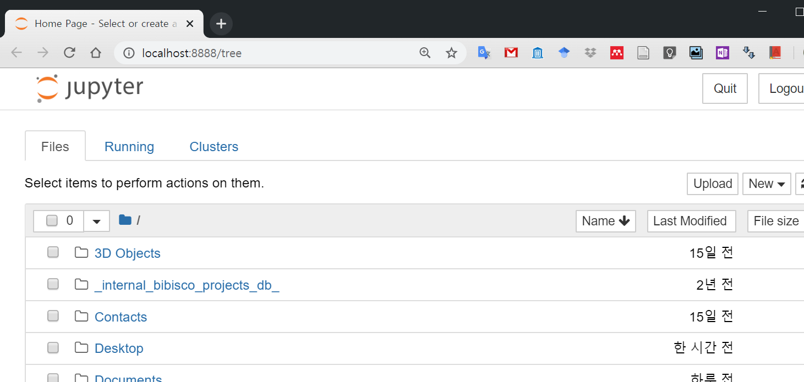
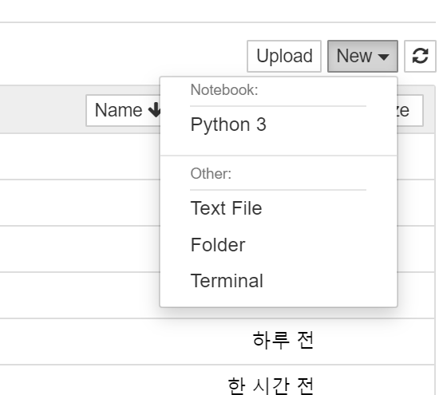

# PYRADIOMICS를 활용하기

## python 사용환경구축

1. anaconda 이용하기 (내컴퓨터에서 돌아가는 환경)

    https://www.anaconda.com/distribution/#windows

    
    python 3.7 64 bit 를 클릭하여 설치합니다.
    default option을 사용하여 설치 진행하면 됩니다.

    
    윈도우 메뉴를 확인하면 위와 같은 것들이 생겼습니다. 몇 가지 해줄 것이 있어 anaconda prompt (anaconda 3)를 먼저 클릭합니다.

    
    
    위 과정은 안해주어도 되는데 하는 것이 나중에 편할 수 있습니다. base는 그대로 유지한채 radiomics라는 환경을 새로 만들어 거기에서 작업을 하게 되면 base는 영향을 받지 않기 때문인데 이를 이용하여 여러 다른 작업환경을 구축할 수가 있습니다. 한 가지 목적으로만 사용하는 경우는 base에서 진행하면 됩니다.

    base에서 진행할 경우 위의 conda create, conda activate는 무시하고 아래부터 진행하면 됩니다.
    python -m pip install pyradiomics
    
    
    마지막에 성공적으로 했다는 메시지가 뜨면 성공입니다.

    
    다시 윈도우 메뉴로 가면 radiomics 새환경을 만든 경우 추가가 된 것을 확인할 수 있습니다. 추가한 경우 radiomics에 대한 jupyter notebook을 실행하고, 그렇지 않은 경우 anaconda3에 대한 jupyter notebook을 실행합니다.

    
    인터넷 브라우저를 통해 jupyter notebook이 실행됩니다. 
    
    
    new를 누르고 python3를 선택합니다.

    
    위와 같이 import radiomics 를 입력하고 실행버튼을 눌렀을 때 에러가 나지 않으면 pyradiomics를 사용할 준비가 끝난 것입니다.

2. google colab 이용하기 (클라우드 환경)

    업데이트예정. 
    더 쉽지만 데이터를 구글드라이브에 올려야 하는 문제가 있음. 은평성모의 경우는 클라우드서비스들이 대부분 막혀 있어 익명데이터도 활용이 어려움. 

